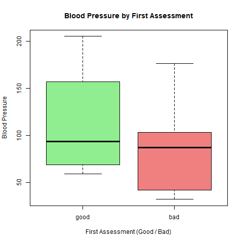
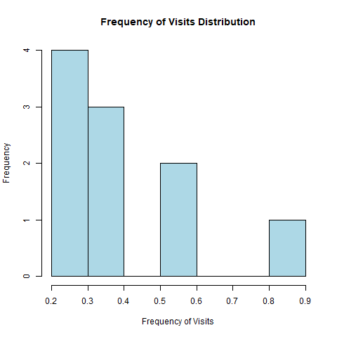

# r-programming-assignments

Name: Yasmine Graham 
Course: LIS4370  

Repository for R Programming Assignments

## Module 4 Programming structure assignment

### Hospital Data Analysis

In this assignment, I analyzed data collected by a local hospital. The dataset includes the following variables:

- **Frequency of Visits (Freq)**
- **Blood Pressure (bloodp)**
- **Doctor's First Assessment (first)**
- **Doctor's Second Assessment (second)**
- **Final Decision by the Emergency Unit (finaldecision)**

The analysis involves visualizing the data through **boxplots** and **histograms** to understand patterns in blood pressure and visit frequency.

### Boxplot of Blood Pressure by Doctor's First Assessment

The boxplot above shows the distribution of blood pressure for patients rated as "good" or "bad" by the first doctor. Patients with "bad" assessments tend to have higher and more variable blood pressure values compared to those with "good" assessments.

### Histogram of Frequency of Visits

This histogram shows the distribution of how often patients visit the hospital. Most patients tend to visit infrequently, with a few who visit more regularly.

## Files
- `analysis.R`: R script that performs the data analysis, including generating the visualizations.
- `boxplot.png`: Boxplot showing blood pressure by first doctor assessment.
- `histogram.png`: Histogram of patient visit frequency.

#################

## Assignment 2 – myMean Function
This repository has a corrected version of the `myMean` function in R.

### Incorrect R Function Error Message:
Error in myMean(assignment2) : object 'assignment' not found

### Why it failed:
The function fails because the variable names inside the function do not match the function argument. The function argument is named assignment2, but the code refers to assignment and someData, which do not exist.

### Corrected R Function:
myMean <- function(assignment2) {
  return(sum(assignment2) / length(assignment2))
}

### Blog Post
[My Blog Post]
https://ygrahamrprogrammingjournal.blogspot.com/2026/01/module-2-assignment-debugging-r.html
